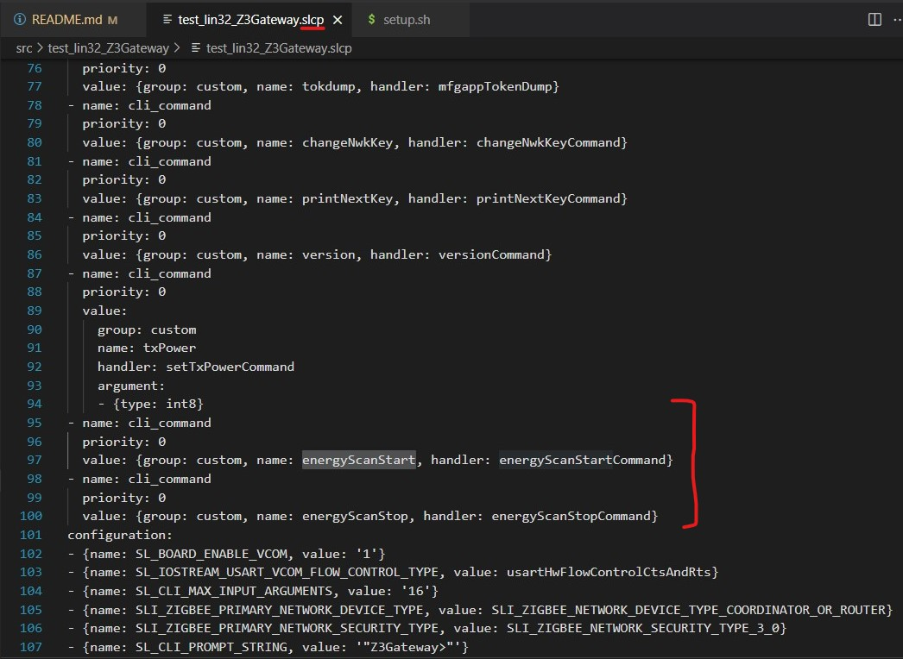

# silabs_multiprotocol - # RSSI Test Setup

- The following setup instruction was tested on RPi4b+ Raspbian OS 32bit version:

    ```text
    terminal_command: lsb_release -a
    
    No LSB modules are available.
    Distributor ID: Raspbian
    Description:    Raspbian GNU/Linux 12 (bookworm)
    Release:        12
    Codename:       bookworm

    // NOTE: 32-bit OS is used in this test
    ```

- All the firmware mentioned was created with Silicon Labs GSDKv4.3.2.

## Hardware

- Isolation
  - [ramsey STE3300](https://ramseytest.com/ste3300)
- DUT:
  - EFR32xG21 2.4 GHz 20 dBm Radio Board (BRD4180A Rev A02)
  
- Host Machine
  - Raspberry Pi
    - Commander & JLink & GSDK enabled using the setup.sh script

- Tone/Random MFGLIB packet sending node
  - EFR32MG12 2.4 GHz 19 dBm Radio Board (BRD4161A Rev A02)

## Firmware

- RCP:
  
  - Changes made to example RCP firmware (Multiprotocol (OpenThread+Zigbee+BLE) - RCP (UART))

    1. Install the component: `CPC SECURITY NONE`

- NCP:
  
  - Changes made to example NCP firmware (Zigbee - NCP ncp-uart-hw)

    1. Install the component: `RAIL Utility, RSSI`- set to -11 by default after installation similar to RCP project.

- Cpcd:

  - Followed compiling and installation instructions from [CPCd website](https://github.com/SiliconLabs/cpc-daemon#compiling-cpcd)
  - Modified the cpcd config file to disable encryption

- Zigbeed:

  - Created project from SSv5 using copy source option

- Z3Gateway:

  - Created project from SSv5 using copy source option
  - Added energy scanning logic provided in the following sections - used the same logic for both NCP and RCP RSSI test

## Setting up the Host - RPi

### Natively Compiling the Host Application on RPi - Using setup.sh

- Install Git

  `sudo apt-get -y install git`

- Clone the branch to the RPi

  `git clone https://github.com/sal515/silabs_multiprotocol.git`

- Move to the Cloned directory

  `cd silabs_multiprotocol`

- Switch to the test branch after cloning the repo to the RPi
  
  `git checkout rssi_test`

  `git status`

- Make the setup script executable

   `chmod +x setup.sh`

- Install commander on the RPi (option to flash the RCP/NCP FW from the RPi to the DUT)

  `./setup.sh -commander-s`

- (Optional) Download and unpack the GSDK 4.3.2 on the Host machine:
  
  `./setup.sh -gsdk-du`

- Download, unpack, and install CPCd on the Host machine:

    `./setup.sh -cpcd-dui`

- Build the Zigbeed project provided in the `src` repository directory

  `./setup.sh -zigbeed-b`

- Build the Z3Gateway project provided in the `src` repository directory

   `./setup.sh -z3gateway-b`

## RCP RSSI test procedure

- Connect only the DUT Board to the Host using USB cable (using UART)

- Flash RCP firmware to the DUT (using commander on RPi)

    `./setup.sh -flash-rcp`

  - Alternatively, flash the RCP firmware to the DUT board before connecting to the Host
  - RCP firmware is provided in the `src` repository directory

- Flash Bootloader firmware to the DUT (using commander on RPi or from PC before connecting to the Host)
  
  `./setup.sh -flash-btl`
  
  - BTL firmware is provided in the `src` repository directory

- Create a (1st) terminal in vscode and execute the following to run `CPCd`:
  
  `./setup.sh -cpcd-o`

- Create another (2nd) terminal in vscode and execute the following to run `Socat`:

  `./setup.sh -socat-o`

- Create (3rd) terminal in vscode and execute the following to run `Zigbeed`

  `./setup.sh -zigbeed-o`

- Create (4th) terminal in vscode and execute the following to run the `Z3Gateway in RCP mode`:

  `./setup.sh  -z3gateway-rcp-o`

- Start the energy scan on the Host

  `custom energyScanStart`

- The logs from the RCP z3gateway mode shoud be automatically stored in the **`run`** directory of the Z3Gateway Project in the PATH=`<path>/silabs_multiprotocol/src/test_lin32_Z3Gateway/run/Z3Gateway_RCP_Log.txt`

- Flash the firmware with MFGLIB library to the Tone/Random Packet Sender node:
  - The sender node needs to be connected to the PC - to access the CLI and to send the Tone/RANDOM packets using the following commands.
  
  - Initialization of the MFGLIB to send packets

    ```text
    plugin mfglib start 0 // Enter manufacturing test mode
    plugin mfglib set-channel 11 // Set channel to 11
    plugin mfglib set-power 18 1 // Set power level to 18 dBm
    plugin mfglib status // Verify radio is in test mode and the parameters that were set
    in previous steps

    plugin mfglib tone start 
    plugin mfglib tone stop

    plugin mfglib send random 12 8 // Send 12 packets with random data of 8 bytes packet length
    plugin mfglib stop // Exit manufacturing test mode
    ```

  - Commands to send the MFGLIB packets

    ```text
    plugin mfglib send random 12 8 // Send 12 packets with random data of 8 bytes packet length
    <!-- plugin mfglib stop // Exit manufacturing test mode -->
    ```

    [Section 3.4 AN1162](https://www.silabs.com/documents/public/application-notes/an1162-using-manufacturing-library.pdf)

- Our goal is to observe and compare the RSSI values in the Z3Gateway logs with and without transmission in the air.

## NCP RSSI test procedure

- Terminate all the programs that were running for the RCP test using

   `CTRL + C`

- Connect the DUT Board to the Host using USB cable (using UART)

- Flash NCP firmware to the DUT (using commander on RPi)

    `./setup.sh -flash-ncp`

  - Alternatively, flash the NCP firmware to the DUT board before connecting to the Host
  - NCP firmware is provided in the `src` repository directory

- In one of the terminals on the Host - start the NCP Gateway application using:

  `./setup.sh -z3gateway-ncp-o ttyACM0`

  - Please note: Typically, the port is ttyACM0; sometimes it switches to ttyACM1

- Start the energy scan on the Host

  `custom energyScanStart`

- The logs from the NCP Z3Gateway mode shoud be automatically stored in the **`run`** directory of the Z3Gateway Project in the PATH=`<path>silabs_multiprotocol/src/test_lin32_Z3Gateway/run/Z3Gateway_RCP_Log.txt`

- Use the sender Node with the MFGLIG library to send Tone/random packets in the controlled environment
  - Commands to send the MFGLIB packets

    ```text
    plugin mfglib tone start 
    plugin mfglib tone stop
    
    plugin mfglib send random 12 8 // Send 12 packets with random data of 8 bytes packet length
    <!-- plugin mfglib stop // Exit manufacturing test mode -->
    ```

## Host Code

```Code

// app.c file

#include "scan-dispatch.h"
#include "network-creator-config.h"

#define ENERGY_SCAN_RESTART_DELAY (1000U)

static uint32_t energy_scan_restart_count = 0;
static sl_zigbee_event_t energy_scan_event;

void scanHandlerCrashTest(EmberAfPluginScanDispatchScanResults *results){
   EmberNetworkScanType scanType
    = emberAfPluginScanDispatchScanResultsGetScanType(results);

  if (emberAfPluginScanDispatchScanResultsAreFailure(results)) {
    // If we are here, that means the call to emberStartScan was a failure
    // in the scan-dispatch plugin (see scan-dispatch.h). So fail.
    sl_zigbee_app_debug_println("\nScan failure: 0x%02X", results->status);
  } else { // success
    if (emberAfPluginScanDispatchScanResultsAreComplete(results)) {
      sl_zigbee_app_debug_println("Scan complete. Channel: %d. Status: 0x%X\n #%lu - Restart Energy Scan in %lu ms <====",
                   results->channel,
                   results->status,
                   energy_scan_restart_count++,
                   ENERGY_SCAN_RESTART_DELAY);
      sl_zigbee_event_set_delay_ms(&energy_scan_event,
                                   ENERGY_SCAN_RESTART_DELAY);
    } else { // results
      if (scanType == EMBER_ACTIVE_SCAN) {
        sl_zigbee_app_debug_println("Found network!");
      } else if (scanType == EMBER_ENERGY_SCAN) {
        sl_zigbee_app_debug_print("Energy scan results: ");
        sl_zigbee_app_debug_println("Channel: %d. Rssi: %d",
                     results->channel,
                     results->rssi);
      }
    }
  }
}

void startEnergyScan() {
  // Scan Dispatch Test

  sl_zigbee_app_debug_println("\n===> Scan Start");
  EmberStatus status;
  EmberAfPluginScanDispatchScanData data = {
    .scanType = EMBER_ENERGY_SCAN,
    .channelMask = EMBER_ALL_802_15_4_CHANNELS_MASK,
    .duration    = EMBER_AF_PLUGIN_NETWORK_CREATOR_SCAN_DURATION,
    .handler     = scanHandlerCrashTest
  };

  status = emberAfPluginScanDispatchScheduleScan(&data);
  sl_zigbee_app_debug_println("Energy Scan result: 0x%02X", status);
}

static void energy_scan_event_handler(sl_zigbee_event_t *event)
{
  startEnergyScan();
}


void emberAfMainInitCallback(void)
{
  // Enable Scan events
  sl_zigbee_event_init(&energy_scan_event, energy_scan_event_handler);
}

// ================ Custom CLI ===========================
// The .slcp file is typically cached - the project should be closed when modifying the .slcp to add the CLI commands


/*
// SLCP File Addition and then generate
- name: cli_command
  priority: 0
  value: {group: custom, name: energyScanStart, handler: energyScanStartCommand}
*/
void energyScanStartCommand(sl_cli_command_arg_t *arguments){
  (void)arguments;
  sl_zigbee_app_debug_println("\nEnergy Scan Event is executed");
  sl_zigbee_event_set_active(&energy_scan_event);
}

/*
// SLCP File Addition and then generate
- name: cli_command
  priority: 0
  value: {group: custom, name: energyScanStop, handler: energyScanStopCommand}
*/
void energyScanStopCommand(sl_cli_command_arg_t *arguments){
  (void)arguments;
  sl_zigbee_app_debug_println("\nFunction0 is executed - Inactive all custom events");
  sl_zigbee_event_set_inactive(&energy_scan_event);
}

```

## Example screenshot of how to add custom CLI using SLCP file


